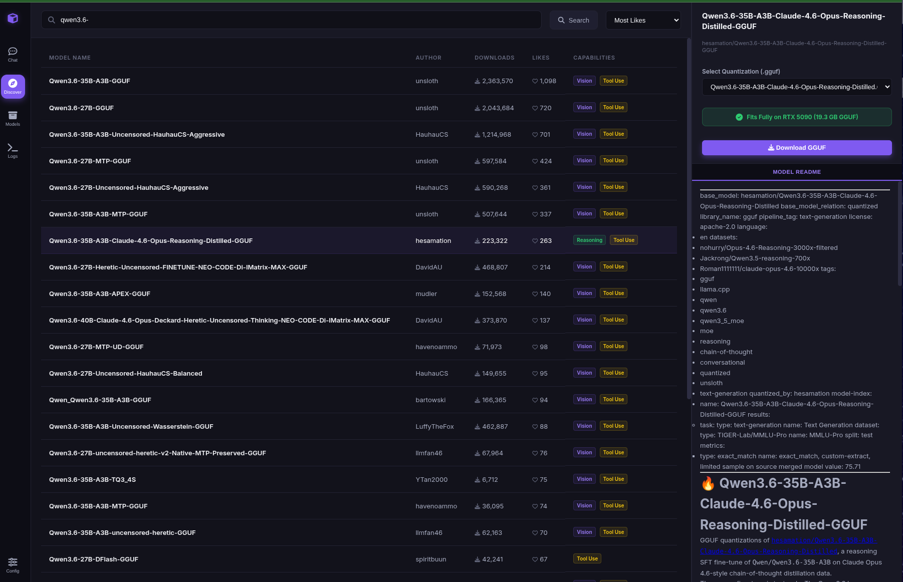
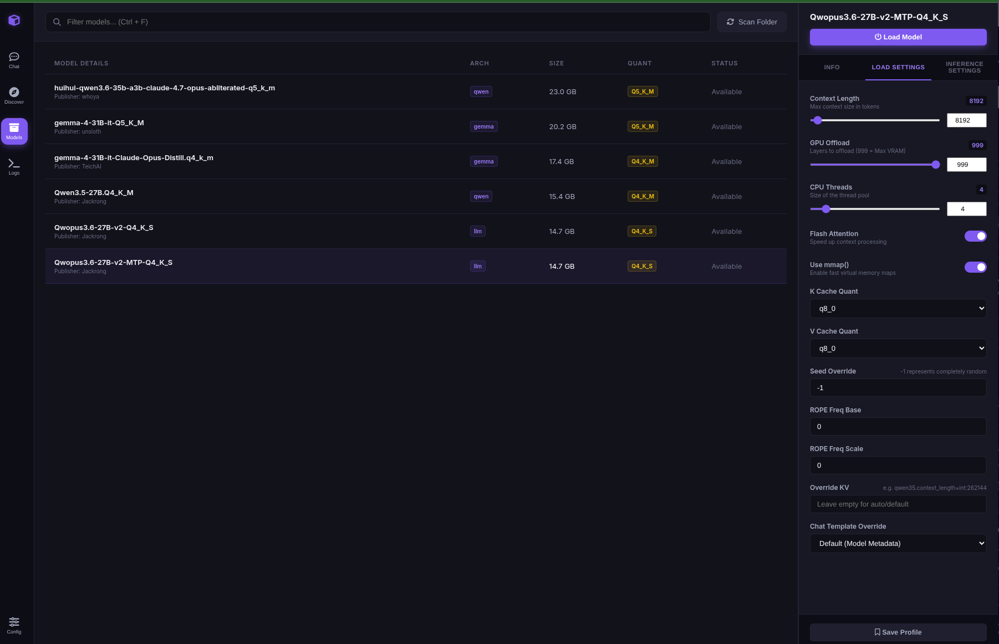
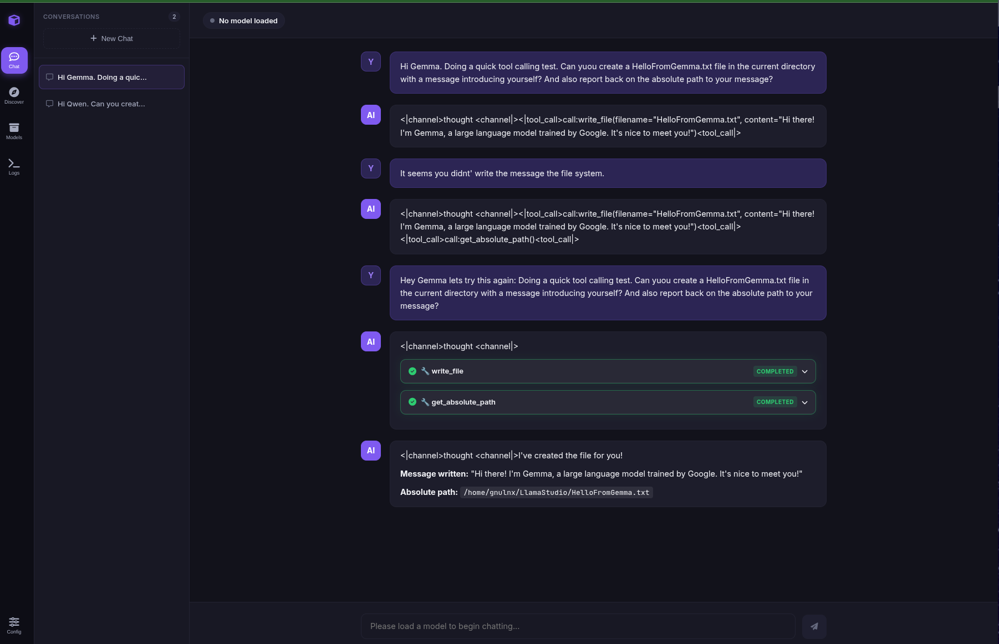

# 🦙 LLamaStudio

A desktop chat interface and local server manager for `llama.cpp`, crafted with **FastAPI** + **HTMX** for ultra-lightweight, zero-framework execution. 

**LLamaStudio** is a self-contained local workspace that manages model lifecycles, features a smart VRAM estimator, scans local folders, and lets you search and download models directly from the Hugging Face Hub.

---

## 📸 Screenshots & Showcase

### 1. Main Chat Dashboard
A Pop!_OS-harmonized dark interface with streaming, collapsible markdown reasoning (thinking) processes, and real-time agentic tool execution logs.


### 2. GGUF Model Browser & Settings
A dynamic local model explorer that scans your directories and lets you adjust context length, GPU offload layers, CPU threads, flash attention, and KV cache quantizations on the fly.


### 3. Hugging Face Discover Hub
Browse the entire Hugging Face GGUF catalog. Features a **Smart VRAM Offload Estimator** calibrated to your hardware, and a floating background download progress card with live speed (MB/s), ETA, and cancel controls.


---

## ✨ Key Features

- **⚡ Zero Node Modules**: Built with HTMX, Tailwind CSS (via CDN), and Vanilla JS. It is incredibly fast, responsive, and has a memory footprint of just a few megabytes.
- **🧭 Hugging Face Discover Tab**: Search the public Hugging Face Hub for GGUF models directly inside the app, view readmes, select quantizations, and download files in the background.
- **🚀 Smart VRAM Estimator**: calulated specifically for your hardware (fits fully on **RTX 5090 32GB VRAM**, partial offload warning, or heavy CPU fallback warning).
- **📂 Automatic Model Scanning**: Scans standard directories (like `~/.lmstudio/models`) automatically on startup or via a one-click rescan button.
- **🪐 Process Lifecycle Manager**: The underlying `llama-server` process only spins up when you explicitly load a model, releasing all system resources and GPU VRAM instantly when you click "Eject".
- **🔧 Configurable Workspace Sandboxing**: Supports sandboxed agentic tool use (file read/write, commands, etc.) with real-time logs in the UI. Workspace and permission defaults are stored in the first-class app config.
- **🖥️ XDG-Compliant Persistence**: App config, conversations, and first-class model profiles are stored outside the codebase directory in standard `~/.config/llamastudio/` with automated backward-compatible migrations.
- **📦 Full Linux & macOS Portability**: Server binaries and model directories are resolved dynamically on startup.

---

## 🛠️ Installation & Setup

LLamaStudio is compatible with **Linux** and **macOS** out-of-the-box. Choose your OS and python virtual environment preference below.

### 🐧 1. Linux Installation

#### Prerequisites
1. **Python 3.10+** (Recommended: Python 3.13)
2. **llama.cpp** built from source (or pre-compiled binary):
   - By default, the app dynamically looks for the `llama-server` binary globally on your system PATH or locally inside your home directory at `~/llama.cpp/build/bin/llama-server`.

#### Environment Setup

##### Option A: Install from PyPI
```bash
pip install llamastudio
```

##### Option B: Conda / Miniconda from source
```bash
# 1. Clone the repository
git clone https://github.com/gnulnx/LlamaStudio.git
cd LlamaStudio

# 2. Create and activate a conda environment
conda create -n llamastudio python=3.13 -y
conda activate llamastudio

# 3. Install LlamaStudio and its dependencies
pip install -e .
```

##### Option C: Python Virtualenv (`venv`) from source
```bash
# 1. Clone the repository
git clone https://github.com/gnulnx/LlamaStudio.git
cd LlamaStudio

# 2. Create and activate a python venv environment
python3 -m venv .venv
source .venv/bin/activate

# 3. Install LlamaStudio and its dependencies
pip install -e .
```

#### 🖥️ Linux Desktop Launcher Integration (Optional)
To integrate LLamaStudio directly into your Linux Application launcher menu (e.g., GNOME / Pop!_OS):
```bash
# 1. Copy the desktop file to your local applications directory
cp llamastudio.desktop ~/.local/share/applications/

# 2. Copy the custom SVG icon to your local icons directory
mkdir -p ~/.local/share/icons/hicolor/128x128/apps/
cp llamastudio.svg ~/.local/share/icons/hicolor/128x128/apps/

# 3. Update your desktop database and icon cache
update-desktop-database ~/.local/share/applications/
gtk-update-icon-cache -f -t ~/.local/share/icons
```
*Note: If you are using a virtualenv, edit the executable path inside `~/.local/share/applications/llamastudio.desktop` to point to your specific `.venv/bin/python` interpreter.*

---

### 🍏 2. macOS Installation

#### Prerequisites
1. **Python 3.10+**
2. **llama.cpp** installed globally via Homebrew (highly recommended for macOS):
   ```bash
   brew install llama.cpp
   ```
   *(This automatically places the `llama-server` binary globally on your system PATH, which LLamaStudio will auto-detect immediately!)*

#### Environment Setup

##### Option A: Install from PyPI
```bash
pip install llamastudio
```

##### Option B: Conda / Miniconda from source
```bash
# 1. Clone the repository
git clone https://github.com/gnulnx/LlamaStudio.git
cd LlamaStudio

# 2. Create and activate environment
conda create -n llamastudio python=3.13 -y
conda activate llamastudio

# 3. Install LlamaStudio and its dependencies
pip install -e .
```

##### Option C: Python Virtualenv (`venv`) from source
```bash
# 1. Clone the repository
git clone https://github.com/gnulnx/LlamaStudio.git
cd LlamaStudio

# 2. Create and activate venv
python3 -m venv .venv
source .venv/bin/activate

# 3. Install LlamaStudio and its dependencies
pip install -e .
```

---

### 🪟 3. Windows Installation
*Note: Native Windows execution is currently **untested**.* 
However, you can run LLamaStudio on Windows seamlessly via **WSL2** (Windows Subsystem for Linux) by following the standard **Linux Installation** guide above.

Pull requests extending native Windows support (e.g., resolving `.exe` binaries) are highly welcome!

---

## 🚀 Running the Application

### Option A: Via Unified CLI (`lls` - Recommended)
You can link and install LlamaStudio's CLI utility locally to control the desktop app and server seamlessly:
```bash
# Start the desktop application server and open browser UI
lls start
```

### Option B: Via App Launcher Command
After installing from PyPI or source, run:
```bash
llamastudio
```

### Via Application Menu (Linux)
Search for **LLamaStudio** in your desktop search bar (press Super, type "Llama") and click to launch!

---

## 🛠️ Unified Command-Line Interface (`lls`)

LlamaStudio features a CLI built using `rich-click` for visual dashboards and operational efficiency. 

### CLI Subcommands Reference

| Command | Usage | Description |
| :--- | :--- | :--- |
| `start` | `lls start` | Starts the desktop app and opens the browser to the right first-run/chat/models/discover view. |
| `reload` | `lls reload` | Gracefully restarts the desktop FastAPI application backend. |
| `status` | `lls status` | Visual dashboard of FastAPI backend status, loaded model parameters, and GPU memory (VRAM). |
| `ls` | `lls ls` | Prints an elegant table of all GGUF models scanned across local directories. |
| `load` | `lls load [MODEL]` | Boots the server with a GGUF model. If `MODEL` is omitted, prompts you with an interactive menu. |
| `eject` | `lls eject` | Gracefully unloads the active model to free GPU and CPU RAM. |
| `oneshot`| `lls oneshot "prompt"` | Streams thinking traces, text, and executes agentic tools directly in your terminal. |

For example, to boot a model interactively:
```bash
$ lls load
Available Scanned Models:
  1. Qwen3.6-35B-A3B-UD-Q5_K_M (25.2 GB)
  2. gemma-4-26B-A4B-it-Q8_0 (25.0 GB)
  3. DeepSeek-R1-Distill-Qwen-32B-Q5_K_M (21.7 GB)

Select a model number to load: 3
Loading model 'DeepSeek-R1-Distill-Qwen-32B-Q5_K_M'...
```

---

## ⚙️ Configuration & Customization

The application runs fully out-of-the-box with no manual configuration. On first launch, LlamaStudio creates its runtime config under:

```text
~/.config/llamastudio/
  config.json
  model_profiles.json
  conversations.json
  logs/
```

`config.json` stores app defaults, model search directories, workspace permissions, and launch state. `model_profiles.json` stores first-class per-model load and inference profiles. Older `model_settings.json` files are migrated automatically.

---

## 🛡️ Workspace Sandboxing & Embodiment

By default, LlamaStudio restricts agent tools (like reading, writing, and listing files) to the configured workspace directory to prevent accidental path traversals. For CLI launches, the first-run workspace defaults to the directory where `lls start` was run.

Workspace configuration is saved in `~/.config/llamastudio/config.json`. Environment variables are still supported for advanced/bootstrap overrides, but normal users should not need a `.env` file.

Developer details for the config/profile architecture live in [DEV.md](DEV.md).

---

## 🧪 Testing Suite

LlamaStudio features both standard unit tests and comprehensive GGUF integration tests.

### 1. Standard Unit Tests
Verify local installation and confirm backend routing, regex parsing, and sandboxing safety behaviors by running our mock-based test suite:
```bash
python -m unittest discover tests
```

### 2. GGUF Model Integration Tests
For local environments containing active GPUs and downloaded models, you can run the full multi-model GGUF tool-calling integration suite to verify real-time execution robustness across various chat templates:
```bash
# Run GGUF model integration tests locally
./tests/test_all.sh
```
*(These tests are automatically skipped in standard CI/CD environments and default `pytest` runs using `@pytest.mark.skipif` to keep pipeline checks fast.)*

---

## 🏗️ Project Structure

```
LlamaStudio/
├── pyproject.toml         # Package metadata, CLI entrypoint, and dependencies
├── DEV.md                 # Development notes for runtime config and profiles
├── llamastudio.desktop    # GNOME/Linux desktop launcher metadata
├── llamastudio.svg        # Custom application vector icon
├── app/
│   ├── config.py          # Settings & dynamic path configurations
│   ├── config_store.py    # First-class runtime config and model profiles
│   ├── main.py            # FastAPI backend endpoints & routing
│   ├── chat.py            # Conversations registry, templates & chat streaming
│   ├── downloader.py      # Async background download manager (chunked writes)
│   ├── model_manager.py   # Scans local paths and Hugging Face Hub
│   ├── server_manager.py  # llama-server subprocess process lifecycle controller
│   ├── logger.py          # Centralized logger
│   ├── tools.py           # Sandboxed local workspace tools for LLM agent use
│   └── templates/
│       └── index.html     # Interactive HTMX frontend interface
├── tests/
│   └── *.py               # Unit and integration-adjacent test coverage
└── imgs/
    ├── chat_interface.png # Screenshot: Main Chat interface
    ├── model_settings.png # Screenshot: Model explorer & settings
    └── discover_models.png# Screenshot: HF Discover & Downloader panel
```

---

## 📄 License

LLamaStudio is open-source software licensed under the [MIT License](LICENSE).
